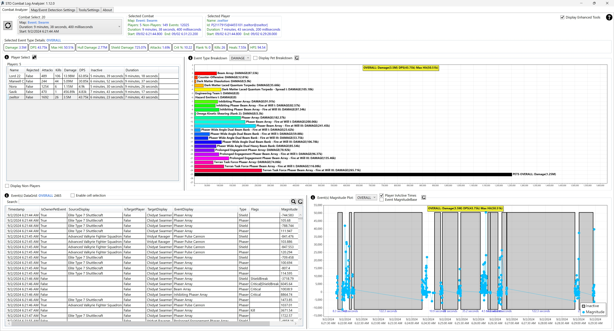

# Star Trek Online Combat Analyzer 

#### Revision History and Updates
For more information please visit the [WIKI](https://github.com/zxeltor/STOCombatAnalyzer/wiki)

* [Overview](#overview)
* [Building](#building)
* [Release and package installer](#release-and-package-installer)
* [Quick Start](#quick-start)
* [Disclaimer](#disclaimer)

## Overview
This is a PC application used to parse and analyze Star Trek Online combat logs. I became interested in trying out STO random elites, but I was curious if my Space DPS was up to snuff. After a little research, I found a reddit post which had a brief outline of the combat log, and the available fields. I figured doing a real-time DPS analyzer would be futile, until I could wrap my head around the combat log and it's fields.

## Building
The source in this repo is wrapped up in a Visual Studio 2022 solution. You should be able to clone this repo localy, then build and run from inside of Visual Studio.

You could also run the dotnet cli build and run commands from inside the zxeltor.StoCombatAnalyser.Interface project folder as well.

## Release Info and Download
See the [wiki](https://github.com/zxeltor/STOCombatAnalyzer/wiki) for more details.

## Quick Start
After you have a successful build, do the following to get started using the application.

- Start the application
- Under the Settings tab, set the following settings:
  - **CombatLogPath**: Set this to match the STO log folder on your local machine.
    - If you click the **select** button, a folder select dialog will appear to help you select a folder.
    - If you click the **detect** button, the application will attempt to get the STO install folder from the windows registry. A dialog box will appear to let you know if it was succesfull, and will update the field with the STO log folder if it was.
  - **CombatLogPathFilePattern**: Set a file pattern used to select one or more combat log files.
    - This search pattern supports wildcards so more then one file can be selected.
  - **MaxNumberOfCombatsToDisplay** You can set the number of combat instances to display in the UI after you parse the logs.
    - If you set this to 0 or less, it will display all combat instances

- Switch to the Log File Analyzer tab:
- Click the **Parse Log(s)** button. If successful, you should see something similar to the following.
  - A dialog will appear and inform you of success, or failure. If a failure occurs, there should be details on what to do.

## Disclaimer
This software and any related documentation is provided “as is” without warranty of any kind, either express or implied, including, without limitation, the implied warranties of merchantability, fitness for a particular purpose, or non-infringement. Licensee accepts any and all risk arising out of use or performance of Software

**Note:** We are not affiliated, associated, authorized, endorsed by, or in any way officially connected with the game Star Trek Online, or any of its subsidiaries or its affiliates. The official Star Trek Online website can be found at [https://www.playstartrekonline.com/](https://www.playstartrekonline.com/en/)
